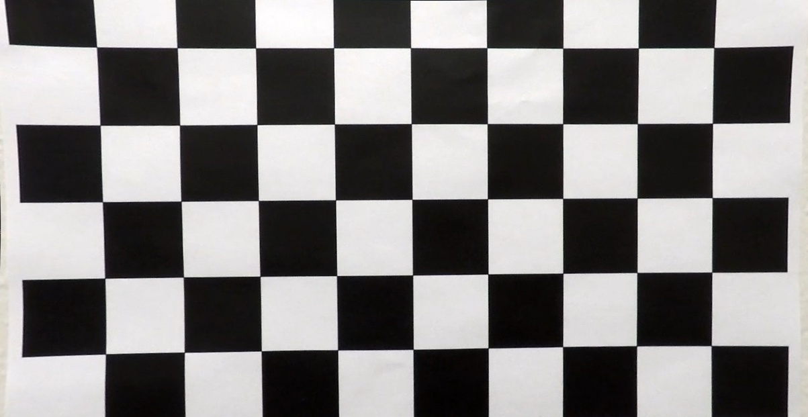
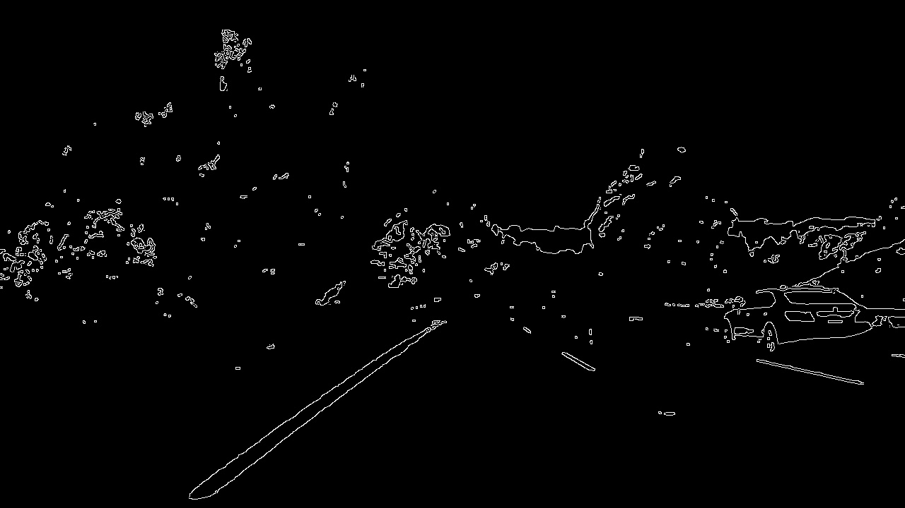

**Lane Finding Project**

The goals / steps of this project are the following:

* Compute the camera calibration matrix and distortion coefficients given a set of chessboard images.
* Apply a distortion correction to raw images.
* Use color transforms, gradients, etc., to create a thresholded binary image.
* Apply a perspective transform to rectify binary image ("birds-eye view").
* Detect lane pixels and fit to find the lane boundary.
* Determine the curvature of the lane and vehicle position with respect to center.
* Warp the detected lane boundaries back onto the original image.
* Output visual display of the lane boundaries and numerical estimation of lane curvature and vehicle position.

### Camera Calibration

#### 1. Briefly state how you computed the camera matrix and distortion coefficients. Provide an example of a distortion corrected calibration image.

The CameraCalibration.py script is used to calibrate a camera by determining its intrinsic parameters and distortion coefficients.

First, we define the number of rows and columns in the chessboard pattern (9x6) and set the termination criteria for the corner sub-pixel refinement algorithm. We prepare a grid of object points corresponding to the expected positions of the chessboard corners, assuming that the chessboard lies on the ('x', 'y') plane at z=0. These object points are identical for all calibration images.

Next, we loop through all calibration images located in the camera_cal/ directory. Each image is converted to grayscale, and we attempt to find the corners of the chessboard pattern using the cv2.findChessboardCorners() function. If corners are successfully detected, their positions are refined using the corner sub-pixel refinement algorithm (cv2.cornerSubPix()). The detected corners are then drawn on the image, and a brief visual display allows us to verify the calibration process.

Once the object and image points are collected, we calibrate the camera using cv2.calibrateCamera(), obtaining the camera matrix (camera_matrix), distortion coefficients (dist_coeffs), and rotation and translation vectors (rvecs and tvecs). The calibration results are saved to a file named calib.npz.

To validate the calibration, we applied the distortion correction to a test image using cv2.undistort(). We also optimized the camera matrix for a valid field of view using cv2.getOptimalNewCameraMatrix(). The result is a corrected, undistorted image, which was optionally cropped to display the valid region of the frame.

#### 2. Describe how (and identify where in your code) you used color transforms, gradients or other methods to create a thresholded binary image.  Provide an example of a binary image result.

The preprocessing.py script includes multiple techniques for creating a thresholded binary image. These methods involve color transforms and edge detection, providing a robust way to isolate regions of interest in an image.

Color Transform
In the process_hsv() function, we use the HSV color space to detect specific colors (yellow and white) in the image. This involves:

1. Converting the input image to the HSV color space using cv.cvtColor(image, cv.COLOR_BGR2HSV).
2. Defining lower and upper bounds for the yellow and white colors.
    White: [0, 0, 180] to [255, 80, 255]
    Yellow: [15, 90, 90] to [35, 255, 255]
3. Creating binary masks using cv.inRange(), which thresholds the image to include only the pixels within the defined color ranges.
4. Combining the masks with a bitwise OR operation: cv.bitwise_or(white_mask, yellow_mask).
5. Applying the combined mask to the original image using cv.bitwise_and().
   
The output of this step includes both the masked image and the binary mask used for thresholding.
 masked_image, combined_mask = process_hsv(image)

Edge Detection
In the process_canny() function, we use the Canny edge detection algorithm:

1. The binary mask from process_hsv() is blurred using a Gaussian filter (cv.GaussianBlur()).
2. Canny edge detection is applied using cv.Canny() with adjustable thresholds (thr1 and thr2). This isolates edges based on intensity gradients in the image.
edges = process_canny(combined_mask, thr1, thr2)

Result
The final binary image is a combination of the thresholding and edge detection steps, where regions corresponding to the desired colors (yellow and white) and strong edges are highlighted.

Below is an example of the resulting binary image:

#### 3. Describe how (and identify where in your code) you performed a perspective transform and provide an example of a transformed image.

In the preprocessing.py script, the perspective_transform() function is used to apply a perspective transform. This technique is crucial for converting an image into a bird's-eye view, which is particularly useful in applications like lane detection.

Steps of the Perspective Transform
1. Source Points:
The input src_points represent the coordinates of the region in the original image that you want to transform.

2. Destination Points:
The dst_points represent the coordinates of the desired rectangular region in the output image.

3. Transformation Matrices:
Using cv.getPerspectiveTransform(), the function calculates the transformation matrix M and its inverse Minv. These matrices map the source points to the destination points (and vice versa for the inverse matrix).

M = cv.getPerspectiveTransform(src_points, dst_points)
Minv = cv.getPerspectiveTransform(dst_points, src_points)

5. Applying the Transform:
The perspective transformation is applied to the binary input image using cv.warpPerspective(), which remaps the pixels according to the matrix M.

warped_image = cv.warpPerspective(binary_image, M, (binary_image.shape[1], binary_image.shape[0]))

6. Visualization of Points:
To confirm the transformation region, the function draws the source points on the original binary image using cv.polylines().

image_with_points = cv.polylines(binary_image.copy(), [np.int32(src_points)], isClosed=True, color=255, thickness=3)

Below is an example of the perspective transformation:

#### 4. Describe how (and identify where in your code) you identified lane-line pixels and fit their positions with a polynomial?

TODO: Add your text here!!!

#### 5. Describe how (and identify where in your code) you calculated the radius of curvature of the lane and the position of the vehicle with respect to center.

TODO: Add your text here!!!

#### 6. Provide an example image of your result plotted back down onto the road such that the lane area is identified clearly.

TODO: Add your text here!!!

### Pipeline (video)

#### 1. Provide a link to your final video output.  Your pipeline should perform reasonably well on the entire project video (wobbly lines are ok but no catastrophic failures that would cause the car to drive off the road!).

TODO: Add your text here!!!

### Discussion

#### 1. Briefly discuss any problems / issues you faced in your implementation of this project.  Where will your pipeline likely fail?  What could you do to make it more robust?

TODO: Add your text here!!!

